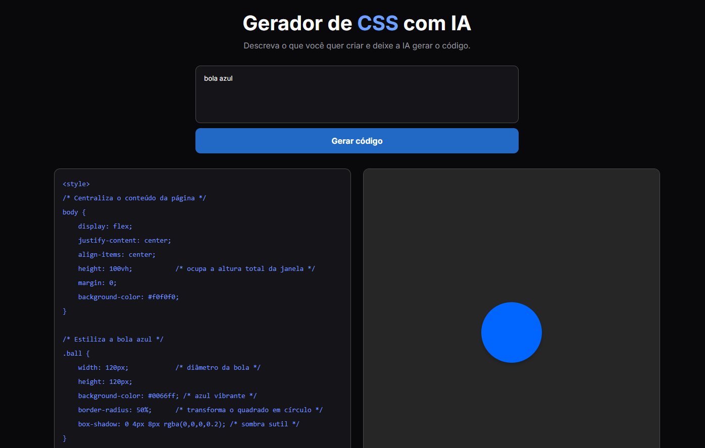

<h1 align="center">🤖 Gerador de Códigos HTML e CSS</h1>

<p align="center">
  Gere códigos HTML e CSS utilizando Inteligência Artificial.<br/>
  Descreva o que você deseja criar e visualize o resultado em tempo real.
</p>

<p align="center">
  <a href="#-tecnologias">Tecnologias</a>&nbsp;&nbsp;&nbsp;|&nbsp;&nbsp;&nbsp;
  <a href="#-projeto">Projeto</a>&nbsp;&nbsp;&nbsp;|&nbsp;&nbsp;&nbsp;
  <a href="#-layout">Layout</a>&nbsp;&nbsp;&nbsp;|&nbsp;&nbsp;&nbsp;
  <a href="#-como-executar">Como executar</a>&nbsp;&nbsp;&nbsp;|&nbsp;&nbsp;&nbsp;
  <a href="#-licença">Licença</a>
</p>

<p align="center">
  
</p>

<br>

<p align="center">
  
</p>

## 🚀 Tecnologias

Esse projeto foi desenvolvido com as seguintes tecnologias:

- HTML
- CSS
- JavaScript
- Groq API
- GPT-OSS-120B
- Git e GitHub

## 💻 Projeto

O **Gerador de Códigos HTML e CSS** é uma aplicação que utiliza Inteligência Artificial para transformar descrições em código.

O usuário pode escrever algo como:

> "Uma bola azul quicando"

A aplicação envia a descrição para a IA, que gera o código HTML e CSS correspondente. O código gerado é exibido na tela e renderizado automaticamente em um preview.

O projeto foi desenvolvido com o objetivo de praticar desenvolvimento web, integração com APIs e utilização de Inteligência Artificial em aplicações.

### ⚙️ Funcionamento

```text
Descrição
    ↓
JavaScript
    ↓
Groq API
    ↓
GPT-OSS-120B
    ↓
HTML + CSS
    ↓
Código + Preview
```

## Como publicar

O projeto usa uma função serverless em `api/generate.js`, portanto o GitHub Pages sozinho não é suficiente. Publique este repositório na Vercel e configure a variável de ambiente `GROQ_API_KEY` com uma chave da Groq.

Depois, faça um novo deploy. Os visitantes poderão usar o gerador sem configurar nenhuma chave no navegador.